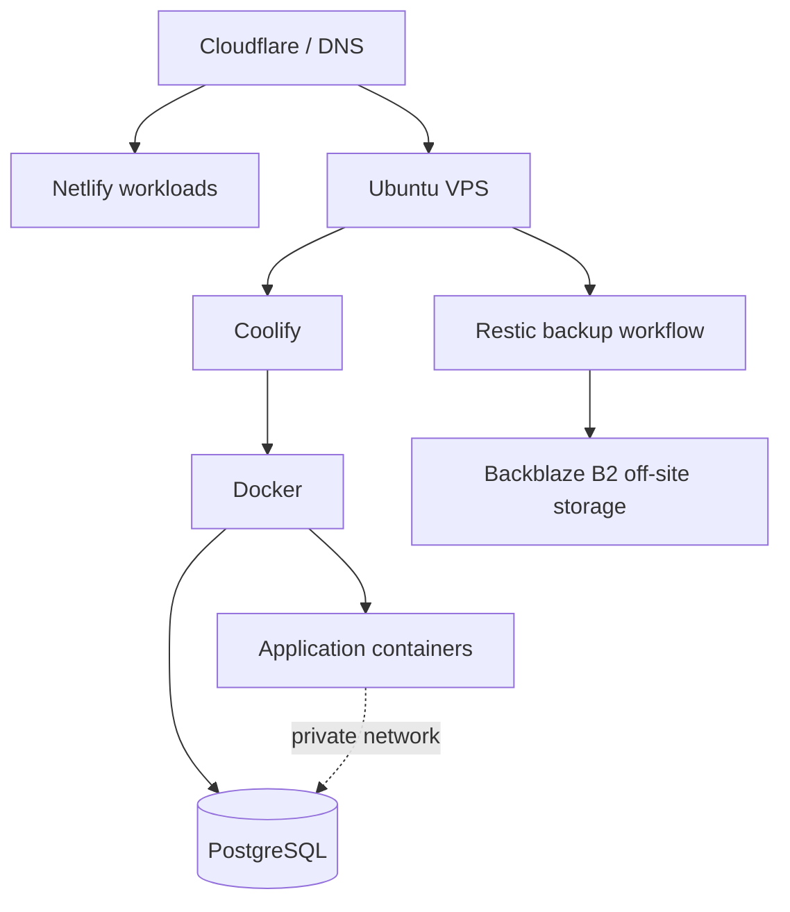

# CirroCore Infrastructure Portfolio

A **sanitized cloud-infrastructure case study** documenting the design, validation, security, deployment, and recovery practices used while building a low-cost application platform for CirroCore.

> **Portfolio scope:** This repository contains reference architecture, sanitized examples, and engineering lessons. It does **not** contain production credentials, customer data, private keys, real environment files, production IP addresses, or a copy of the private infrastructure repository.

## What this project demonstrates

- Ubuntu Linux server administration
- Docker and containerized application hosting
- Coolify-based Git deployment workflows
- Cloudflare and TLS-aware edge design
- private application/database networking
- least-privilege PostgreSQL design
- health-gated deployment and rollback testing
- off-site backup using Restic and Backblaze B2
- PostgreSQL and file-level restore validation
- infrastructure hardening and operational runbooks
- cost-conscious architecture and workload placement

## The engineering problem

CirroCore needed a low-cost environment for new persistent applications, internal tools, APIs, automation workloads, and small database-backed services without unnecessarily moving workloads that were already working well on managed platforms.

The design therefore uses **platform boundaries rather than a one-platform-for-everything approach**:

- **Netlify** remains suitable for existing web and mostly-static workloads.
- A small **Ubuntu VPS** provides a home for persistent Docker-based services.
- **Azure** remains the better fit for Microsoft-heavy, Windows/SQL Server, regulated, or higher-assurance workloads.

This was intentionally designed as a practical small-business platform, not as an enterprise HA cluster.

## Reference architecture



The public architecture is deliberately simplified. Production hostnames, addresses, credentials, recovery material, and provider-account information are not included.

## Deployment validation

The platform was tested with a disposable, stateless application rather than a production workload.

Validation included:

- deployment from a private Git repository;
- HTTPS and certificate validation;
- HTTP-to-HTTPS redirect behavior;
- application and container health checks;
- CPU and memory limits;
- log review for secret leakage;
- deliberate deployment of an unhealthy candidate;
- verification that the unhealthy deployment was rejected;
- continued service from the prior healthy version;
- successful replacement with a healthy version;
- rollback to the prior known-good image.

See [Deployment Validation](docs/deployment-validation.md).

## Backup and recovery validation

The recovery design uses **Restic** with **Backblaze B2** for encrypted off-site storage.

The backup rehearsal included:

- repository initialization and encrypted backup;
- full Restic data-read verification;
- retention-policy dry run;
- PostgreSQL custom-format dump validation;
- deliberate removal of synthetic source data before recovery;
- PostgreSQL restore into a clean target;
- file restore with content and permission verification;
- recovery-material restore into a separate disposable path;
- cleanup of disposable containers, networks, volumes, and local staging data.

The key principle was simple: **a backup is not considered proven until a restore succeeds.**

See [Backup & Recovery](docs/backup-recovery.md).

## Security model

The baseline design emphasizes small, understandable controls:

- named non-root administration;
- SSH key authentication and safe hardening sequence;
- default-deny host firewall;
- minimal public exposure;
- Fail2ban for SSH abuse reduction;
- unattended security updates;
- bounded host/container logging;
- no public PostgreSQL, cache, or Docker daemon ports;
- separate application databases and credentials;
- no application use of the PostgreSQL superuser;
- no secrets committed to Git;
- restore testing before stateful production acceptance.

See [Security Design](docs/security-design.md).

## Repository map

```text
.
├── README.md
├── docs/
│   ├── architecture.md
│   ├── deployment-validation.md
│   ├── backup-recovery.md
│   ├── security-design.md
│   └── lessons-learned.md
└── examples/
    ├── docker-compose.example.yml
    └── healthcheck-example.js
```

## Important limitations

This project does **not** claim:

- multi-region or active-active architecture;
- zero-RPO or zero-RTO recovery;
- Kubernetes orchestration;
- enterprise tenant isolation from a single VPS;
- that every CirroCore workload belongs on the VPS;
- that a successful synthetic restore equals a complete replacement-server disaster-recovery exercise.

The initial recovery assumption is measured in **hours, not minutes**, and workload placement depends on risk, compliance, integration requirements, and business value.

## Skills demonstrated

`Ubuntu` · `Linux` · `Docker` · `Coolify` · `Cloudflare` · `PostgreSQL` · `Restic` · `Backblaze B2` · `Backup & Recovery` · `TLS` · `Deployment Validation` · `Infrastructure Security` · `Git` · `Operational Resilience`

---

**Derek Asamoah-Amoyaw**  
Senior IT Infrastructure & Cloud Engineer · Microsoft Certified: Azure Administrator Associate (AZ-104)  
[GitHub Profile](https://github.com/Deberryx) · [LinkedIn](https://www.linkedin.com/in/derek-asamoah-ctfl-143650b8/)
